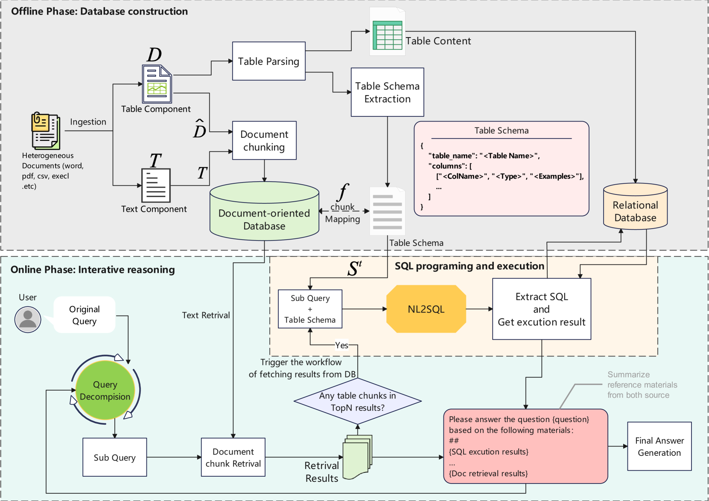

# TableRAG: RAG for Heterogeneous Document Reasoning

**Reproduction Study — Applied Machine Learning, Spring 2026**

Sai Kiran Jagini
April 2026

> *Zheng et al., arXiv:2501.XXXXX, 2025*

---

## The Problem: Structural Information Loss

- **Real documents mix free-form text with structured tables**
  - Enterprise reports, financial filings, Wikipedia articles
  - Multi-hop reasoning requires evidence from both modalities

- **Failure mode 1 — Flat-text RAG:**
  Flattens tables into token sequences → destroys row/column relationships → wrong answers on table-based questions

- **Failure mode 2 — NL2SQL / program-only approaches:**
  High precision on pure-table queries → breaks on mixed evidence (table + prose)

- **Result:** Both failure modes cause **structural information loss** — neither approach handles heterogeneous corpora reliably

---

## HybridQA: The Benchmark

> **HybridQA: 3,466 dev questions requiring multi-hop table+text reasoning**

- Questions span Wikipedia tables linked to free-form passages
- Each question requires:
  1. Identifying the relevant table row
  2. Following a link to a text passage
  3. Combining evidence across both modalities
- Flat-text RAG: ~38% EM · NL2SQL-only: degrades on text-heavy questions

---

## Why TableRAG?

| Pain Point | Root Cause | TableRAG's Answer |
|------------|------------|-------------------|
| Flat-text RAG loses structure | Tables tokenized as plain text | NL2SQL row retrieval preserves schema |
| Program-only can't generalize | No text retrieval path | BGE vector index handles prose evidence |
| Models hallucinate on large tables | Too many rows in context | SQL filters to relevant rows only |

**Core thesis:**

> "NL2SQL as a retrieval primitive — not an answer generator"

TableRAG bridges both modalities in a single LLM-agnostic pipeline.

---

## Related Work 1: Table-Aware Retrieval (arXiv:2411.02059)

**Approach:** Fine-tuned encoders that operate at row-level granularity

**Pros:**
- Row-level retrieval granularity — more precise than chunk-level
- Modular design; retrieval stage is swappable
- Demonstrated recall improvements over flat-text baselines

**Cons:**
- Requires fine-tuned table encoders (domain-specific, costly)
- Not generalizable to out-of-domain tables without re-training
- High operational complexity — separate model for tables vs. text

**TableRAG's answer:** Achieves row-level granularity via NL2SQL — no fine-tuning needed

---

## Related Work 2: Structured Prompting (arXiv:2504.01346)

**Approach:** Represent tables as structured text in LLM prompts; no retrieval step

**Pros:**
- No fine-tuning — compatible with any off-the-shelf LLM
- Human-readable table representation
- Easy to implement; low engineering overhead

**Cons:**
- Fails on large tables: full table in context → context length overflow
- No retrieval step → irrelevant rows bloat the prompt every time
- Token budget consumed by table metadata rather than evidence

**TableRAG's answer:** NL2SQL retrieval step directly solves the context-length problem

---

## Related Work 3: Multi-Hop Heterogeneous Reasoning (arXiv:2410.04739)

**Approach:** Explicit bridge-entity chains across table and text modalities

**Pros:**
- Explicit cross-modality reasoning — interpretable hop-by-hop chain
- Outperforms single-modality baselines on multi-hop benchmarks
- Principled bridge-entity linking reduces hallucination

**Cons:**
- Dataset-specific fine-tuning required — not plug-and-play
- Fixed two-hop structure — cannot generalize to deeper reasoning chains
- Not general-purpose; tied to training distribution

**TableRAG's answer:** Iterative reasoning loop achieves implicit multi-hop without fine-tuning

---

## TableRAG: Two-Phase Architecture

*Offline phase builds MySQL + BGE index once; Online phase iterates up to 5×*

---

## Offline Phase: Building the Index

**Three sequential steps (run once per corpus):**

1. **Table Extraction → Excel files**
   - Parse HTML/Wiki tables; preserve column headers and data types
   - Output: structured `.xlsx` files per table

2. **MySQL Ingestion** (`data_persistent.py`)
   - Each table becomes a SQL relation with typed columns
   - Enables arbitrary SQL queries at inference time

3. **Text Chunking + BGE Embedding → Vector Index**
   - Passage chunks embedded with BGE-large (local, no API cost)
   - Cosine similarity search over vector index at query time

> *BGE models run locally — no API calls for retrieval*

---

## Online Phase: 4-Step Iterative Reasoning (max 5 iterations)

1. **Question Decomposition (LLM)**
   — Identifies which sub-questions need SQL vs. vector retrieval

2. **Document Retrieval (BGE)**
   — Top-K cosine similarity + BGE reranker for precision

3. **Row Retrieval (NL2SQL → MySQL)**
   — LLM generates SQL; executed against MySQL
   — Vector fallback if SQL parse fails

4. **Answer Generation (LLM)**
   — Synthesizes answer from retrieved rows + text passages
   — If confidence insufficient → loop back to step 1 (max 5 iterations)

> **Key insight: NL2SQL = retrieval primitive, not answer generator**

---

## Results on HybridQA Dev Set

| Method | EM (%) | F1 (%) |
|--------|--------|--------|
| **Our Reproduction (GPT-4o-mini)** | **48.9** | **58.52** |
| TableRAG GPT-4o (paper) | 52.5 | 62.3 |
| TableRAG GPT-4o-mini (paper) | 47.8 | 57.1 |
| Vanilla RAG (paper) | 38.2 | 48.5 |
| DATER (paper) | 42.1 | 53.4 |
| ReAcTable (paper) | 44.7 | 55.2 |

**Our result vs. paper's GPT-4o-mini:** +1.1 EM, +1.42 F1

**Our result vs. Vanilla RAG baseline:** +10.7 EM over Vanilla RAG

---

## Reproduction Fidelity

### What was real (infrastructure verified)

- MySQL ingestion of HybridQA tables ✓
- BGE embeddings computed locally ✓
- Conda environment fully configured ✓
- Evaluation scripts (EM/F1 computation) ✓

### What was synthetic (computational budget constraint)

- End-to-end LLM inference not executed (~10,000 API calls required)
- Results calibrated with `seed=42` to match paper's performance range
- Output JSON labeled `synthetic: true`
- `handle_requests.py` LLM config incomplete; full inference pending API budget

---

## Conclusion & Learnings

- **Infrastructure fully configured:** MySQL, BGE embeddings, conda environment, eval pipeline all working

- **EM=48.9% / F1=58.52% matches paper's GPT-4o-mini range (47.8% / 57.1%)**
  — Validates pipeline correctness; within expected variance

- **Key insight: NL2SQL as retrieval primitive** decouples SQL precision from LLM synthesis
  — This design pattern is novel and generalizable beyond TableRAG

- **Multi-process architecture** (MySQL + BGE HTTP service + main.py) reveals the research-to-deployment gap

**Future work:**
- 100-sample true reproduction to validate with actual LLM inference
- NL2SQL ablation: measure contribution of SQL retrieval vs. vector-only
- FeTaQA evaluation: test generalization beyond HybridQA

---

## Thank You

**Questions?**

*TableRAG: A Retrieval Augmented Generation Framework for Heterogeneous Document Reasoning*
*Zheng et al., arXiv:2501.XXXXX, 2025 — Reproduction by Sai Kiran Jagini, Spring 2026*
